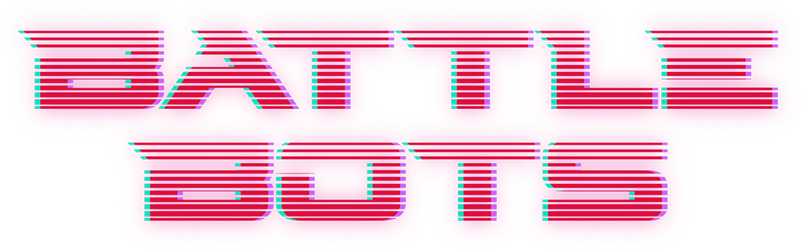

<link rel="stylesheet" type="text/css" href="style/style.css">
<link rel="stylesheet" type="text/css" href="style/dark-theme.css">
<link rel="stylesheet" type="text/css" href="style/dark-code.css">

<!-- Side navigation -->
<div class="sidebar">
  <h1>Sommaire</h1>
  
  <a href="Manuel%20du%20participant.html">Manuel du participant</a>
  <br/>
  <span>Serveur</span>
  <ul>
    <li><a href="serveur/Installation%20du%20serveur.html">Installation du serveur</a></li>
    <li><a href="serveur/Configuration%20du%20serveur.html">Configuration du serveur</a></li>
  </ul>
  <span>Technique</span>
  <ul>
    <li><a href="tech/Contrats%20d'interfaces.html">Contrats d'interfaces</a></li>
    <li><a href="tech/Contrats%20d'interfaces%20-%20Admin.html">Contrats d'interfaces - Admin</a></li>
  </ul>
</div>

<!-- Page content -->
<div class="main">

<center></center>

# Manuel du participant

- [Manuel du participant](#manuel-du-participant)
  - [Prérequis](#prérequis)
    - [Installer le serveur](#installer-le-serveur)
    - [Installer la bibliothèque Python](#installer-la-bibliothèque-python)
  - [Et maintenant, par où commencer ?](#et-maintenant-par-où-commencer-)
    - [Configuration des connexions](#configuration-des-connexions)
    - [Documentation](#documentation)
    - [Tests](#tests)


## Prérequis

### Installer le serveur

Pour permettre de tester l'IA, il faut commencer par installer et faire fonctionner le serveur Battlebots en local.

Parmi les éléments qui vous ont été fournis, vous devez avoir le package `battlebots-server-package.zip`

Suivez les procédures [Installation du serveur](serveur/Installation%20du%20serveur.html) et [Configuration du serveur](serveur/Configuration%20du%20serveur.html)

### Installer la bibliothèque Python

Une bibliothèque permettant d'inscrire et d’interagir avec votre IA a été écrite : `battlebotslib`

Parmi les éléments qui vous ont été fournis, vous devez avoir le package `battlebotslib.zip`

Suivez la procédure [Installation de la lib Python](client/Installation%20de%20la%20lib%20Python.html).

## Et maintenant, par où commencer ?

A ce stade vous devez avoir un serveur qui démarre et un nouveau projet Python avec la bibliothèque `battlebotslib` installée.

### Configuration des connexions

Pour que la lib fonctionne, il faut créer 3 fichiers de configuration qui vont donner les informations de connexions aux différents services.

Ils sont à créer dans votre projet Python, dans un sous-dossier `conf`.

Voici les fichiers avec les informations pour vous connecter à votre serveur local :

**conf/rest.json**
```json
{
  "host": "localhost",
  "port": 8000,
  "protocol": "http"
}
```

**conf/mqtt.json**
```json
{
  "destination_root": "BATTLEBOT/BOT/",
  "username": "user",
  "password": "password",
  "host": "localhost",
  "port": 1883,
  "connect_timeout": 5
}
```


**conf/stomp.json**
```json
{
  "destination_root": "BATTLEBOT.BOT.",
  "username": "user",
  "password": "password",
  "host": "localhost",
  "port": 61613
}
```

### Documentation

#### Documentation technique de la lib Python

Description de toutes les fonctions et exemple de code pour créer une IA avec cette bibliothèque.

- [battlebotslib - BotAi](tech/battlebotslib%20-%20BotAi.html)

#### Contrats d'interfaces

Description des messages envoyés vers le serveur et reçu par celui-ci.

- [Contrats d'interfaces](tech/Contrats%20d'interfaces.html)
- [Contrats d'interfaces - Admin](tech/Contrats%20d'interfaces%20-%20Admin.html)

### Tests

Pour relancer une partie sans avoir à relancer tous les exécutables, faire `Ctrl` + `C` dans le navigateur et taper le mot de passe admin du serveur (`password` par défaut).  Au bout de 5 secondes, le navigateur rechargera la page pour afficher l'écran d'attente. Si ce n'est pas le cas vous pouvez recharger la page manuellement.

N'oubliez pas que pour tester votre IA, vous pouvez démarrer une partie avec de faux joueurs sans IA : [Bots factices](serveur/Configuration%20du%20serveur.html#bots-factices)

---

[⬆️ Retour](#top) - _Manuel du participant_

</div>
